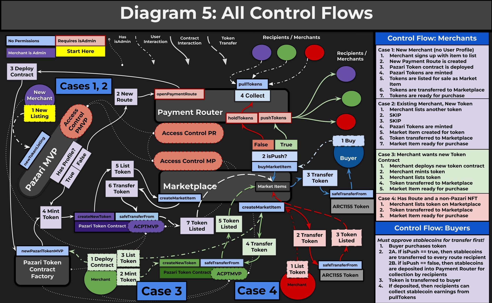

# Welcome to Pazari Contracts

This repository holds the current version of the Pazari digital marketplace's smart contracts:

- Payment Router
- Marketplace
- Pazari Token MVP
- Pazari Token MVP Factory
- Pazari MVP
- Interfaces for every contract

## Purpose and Introduction

### What is Pazari?

Pazari is the world's first universal digital marketplace that can be described as "Web3 Shutterstock on Steroids". Pazari aims to be a one-stop-shop for any kind of digital file, not just stock assets like Shutterstock offers, but even entire programs, software, and data files will be sellable as well. Pazari is a platform that Merchants of all types and from all disciplines can find a market for their skills, no matter how big or small--and all Merchants who sell on Pazari keep far more earnings than their peers on Web2 platforms.

While the business model of Pazari strongly resembles that of Shutterstock, the actual variety of file types will be more comparable to The Pirate Bay--but with all items sold legitimately.

Pazari's MVP can support several file types such as PDFs, MP3s, MP4s, JPEGs, and even game assets. Over time support for additional file types will roll out until Pazari becomes a singular destination where you can buy, sell, and download _anything_ digital.

After Pazari V1 has gone live, we will focus on rolling out Pazari Collaborations. This key expansion to the Pazari ecosystem which will use multi-signature smart contracts to create group projects that pay out royalties to contributing members from every item sale. Items created through a Collaboration Contract will be managed by group votes, ensuring that all contributors have an equal say in how the item is sold. While this feature is still only in its conceptual phase, this will become a core feature of Pazari's unique business model after Pazari V1 has gone live and work on Pazari Collaborations begins.

### How are files uploaded to Pazari for sale?

All digital files are first sent through "file tokenization", a process which securely stores and encrypts the original file on a private server (_not_ hosted by AWS), and then creates any number of cryptocurrency tokens that can be purchased on NFT exchanges and through the Pazari Marketplace. Once purchased, these tokens contain a link to download the file(s) and a decryption key to unlock them. A simple wallet check is conducted by the server hosting the encrypted files to check that the user owns the token that unlocks the them, and if they pass the check then the content is unlocked and they can download the file they purchased.

Later, the Pazari engine will be able to handle the decryption process behind the scenes for certain file types, and will even support in-browser decryption and content streaming similar to apps like Spotify and Kindle, which can be used to create DRM-protected content that can be retraded after purchase just like an NFT can. However, this idea is still in its conceptual phase, and for now all content sold on Pazari is protected through watermarking and encryption, and is directly downloaded to the buyer's device(s) similar to Shutterstock.

### What can we do with these tokens? Why use tokens at all?

Tokens come with the core feature of verifiable ownership, and serve as a permanent receipt of purchase that is stored on-chain forever (unless burned).

The wallet check feature can be implemented by anyone on their personal website, and is intended for Merchants looking to explore new business models that revolve around rewarding customers through exclusive content and opportunities that are only available to their Pazari customers. This creates new marketing gimmicks like unlocking bonus content for customers who own specific tokens, conducting free "airdrops" of tokenized content to specific Pazari customers, and exclusive-access members' areas that are only unlocked when a special token is owned--just to name a few ideas.

There are many things that can be done with the ability to rapidly check how many--and which--tokens a wallet holds, and Pazari Tokens themselves make it easy to reward their buyers (more on that later). This use case is already employed by many NFT projects, and is nothing new to the blockchain industry, but Pazari aims to take this ability to the next level and make it readily available to non-crypto people.

Tokens can also represent a content use license that can be checked at any time by anyone. If content use disputes arise, then the buyer only needs to prove they control the wallet that purchased a token to settle the dispute. However, since Pazari is a global marketplace it is advised to not post any restricted-use licenses until Pazari can implement Avalanche sub-nets that can provide legal support for such licenses in various jurisdictions. For now, Merchants can freely and safely sell content that has full content use licensing for all applications, commercial or personal.

Pazari MVP's Marketplace contract is capable of handling ERC1155 NFTs, but not ERC721 NFTs just yet. Support for ERC721 NFTs will be available soon after the MVP is deployed. The Pazari MVP immediately begins restricted to its own purpose-built token that is designed to be a one-way-transfer token specifically intended for downloadable digital content, and cannot be transferred after sale unless they are being burned or sent back to the seller. Soon after release Pazari MVP will expand into off-platform NFTs that can be sold by their owners, and eventually we will offer unique NFT smart contracts and minting applications that will permit Merchants to create their own truly unique NFT collections through Pazari without ever needing to find a Web3 developer.

### What do the Pazari smart contracts do?

The Pazari core smart contracts handle functionality for creating, listing, buying, and managing stock/details for tokenized content, and--most importantly--transmitting payments to all recipients. They also provide each Merchant with their own unique Pazari Token contract that they alone control, and later will provide many additional (optional) smart contracts that Merchants can deploy and implement into their business models to further increase their income streams.

The two most essential (core) contracts in the Pazari ecosystem are the Payment Router and the Marketplace. Around these two contracts are the supporting contracts such as the Pazari Token factory that produces new Pazari Token contracts for all new Merchants, and the Pazari MVP helper contract that makes everything crazy simple.

## Payment Router

The Payment Router contract is responsible for handling all payments coming from the Marketplace contract, and is able to accept new contracts that also need to use it. Only Pazari smart contracs are allowed to use the Payment Router's token distribution functions, but anyone can collect their payments from the router at any time.

The Payment Router takes ERC20 tokens, splits them, and transfers the tokens to a list of recipients--each of whom can receive a different share of each transfer. This completely removes the need for trusted intermediaries to distribute commissions and royalties from item sales, and allows for instant settlement of all payments with no minimum holding periods for collection/receipt. The Payment Router can transfer payments directly to multiple recipients' wallets, however it is much cheaper to let the contract hold the payments for collection by the recipients.

The Payment Router relies on "payment routes", which group together the route's recipients, their commissions, and the platform sales tax paid by the route. Payment routes also track if the route is active or not, and they determine how a route tax responds when the minimum or maximum tax bounds are changed.

Each route extracts a "route tax" before routing a payment to its recipients, and route taxes are sent to the Pazari treasury to be used for funding and expanding the platform. This tax will be between 3% - 5%, and later will be governed by a DAO. However, Merchants can opt to pay more than the minimum tax, and benefits for doing so will be rolled out over time and will be the primary way in which Pazari Governance Tokens (PGT) will be minted (PGT is still a conceptual idea at this time).

More than one market item can use the same payment route, and Merchants are able to own multiple payment routes with different recipients and route taxes. Many sellers on Pazari will only own one payment route with them being the sole recipient, but they can also be recipients on other sellers' routes--which will be used much more often when Pazari Collaborations are rolled out.

Payment routes are not picky and will route any ERC20 tokens that are sent through them, and they don't need to be updated if the seller changes which token they want to accept for payment. For Pazari's MVP, payment routes will initially be limited to 10 recipients maximum, but Pazari V1 will be capable of handling any number of recipients.

Platform sales tax is taken out of payment routes when they process payments, and not by the Marketplace contract. For most people this means platform tax is something they adjust for their profile, and applies across all their items. There are ways to get around this limitation so Merchants can pay different sales tax on different items, which can be implemented upon popular request if it's something they'd like to have.

Later, when the Pazari Governance Token is deployed then paying above-minimum sales tax will earn PGT tokens for Merchants, which will be used for governance in the DAO and will provide several benefits and use cases valuable for Merchants and Customers alike.

While the Payment Router is capable of accepting and routing _any_ ERC20 token as a payment method, Pazari MVP will only use one ERC20 token for all payments--a stablecoin. Future versions of Pazari will support multiple ERC20 stablecoins, and eventually we aim to be able to accept any token as payment by auto-swapping them through a DEX at the point of sale.

Payment Router admins are responsible for adjusting the minimum and maximum sales tax that can be paid, changing the Pazari treasury address, and setting the maximum number of recipients that can exist in a payment route.

## Marketplace

This contract handles the listing, purchasing, and management of market items. It supports any ERC1155 tokens for market items, especially Pazari Tokens. The Marketplace contract talks directly to the Payment Router to handle the payment process, and is allowed to call pushTokens() and holdTokens().

When a user purchases an item the Marketplace pulls the payment from the buyer's wallet, sends it to the Payment Router with instructions on how to process it, and then transfers the purchased token(s) to the buyer. The Marketplace contract is currently limited to ERC1155 semi-fungible tokens, however support will roll out soon for ERC721 non-fungible tokens as well. Pazari MVP initially will only permit Pazari Tokens to be sold, but support for off-platform NFTs will come soon after launch (see Pazari Token below for more information on these special tokens).

The Marketplace is where market item details can be retrieved and token ownership can be checked, and handles inventory management actions including restocking and pulling tokens, modifying listing details, toggling whether an item is for sale or not, permanently deleting an item, and managing administrative privileges.

Merchants on Pazari MVP maintain administrative privileges over their market items at all times, even if they add or remove other addresses as item admins, and only a market item's original creator (or Pazari admin) has the ability to delete their market item. Pazari MVP does not support transferring this ownership, but Pazari V1 will.

Marketplace admins are in charge of managing the address blacklist, recovering lost NFTs accidentally sent to the Marketplace contract, and on rare occasions deleting market items that are in violation of platform guidelines. Addresses that violate Pazari's community guidelines (especially those that sell other people's content) can be blacklisted and will be unable to interact with the Pazari smart contracts until they have been whitelisted again.

## Pazari Token

Pazari uses a fork of the ERC1155 SFT smart contract for its market items. These purpose-built tokens are intended for one-way transfers from the seller/Marketplace to the buyer, but cannot be transferred by the buyer after purchase unless they are either burning the tokens or transferring them back to the seller (such as for refund cases).

These tokens are pseudo-NFTs, and carry the benefits of verifiable ownership provided by NFTs without the ability to transfer the tokens after purchase--making them ideal for stock content licenses and various forms of media that shouldn't be traded after purchase, such as downloaded content.

Pazari Tokens come natively equipped to track token holders and conduct airdrops, however a better airdropping contract will be made available later that will be able to handle any amount of airdrops for cheap.

## Pazari Token MVP Factory

### Title: FactoryPazariTokenMVP

The contract factory produces the Pazari Token MVP contract. There's not much to say about this contract, it has exactly one function, and all it does is clone a Pazari Token MVP contract. It receives a list of all "admins" who are able to call sensitive functions within the contract and who are granted automatic operator approval for handling tokens, and must include the seller's address as well as the factory's address in order for the permissions system to operate correctly.

Failure to include the factory's address will result in the factory becoming the owner of the contract, so it is very important for anyone calling this contract outside of the front-end to include the factory's address among the admins.

The factory contract is not permissioned in any way, and anyone can call the function that deploys a new Pazari Token MVP contract. However, the only way anyone can access this contract from the front-end is through the Pazari MVP new token listing page, which calls the factory to clone a new token contract as part of user profile generation. Contract factories after Pazari MVP will be permissioned and only accessible through helper contracts, which will track and record on-chain stats about every contract deployed and the addresses who own them.

## Pazari MVP

### Title: PazariMVP

This is a helper contract which ties all contracts together into one simple function call that only requires one transaction, and all a new seller needs to do is show up with an item they would like to sell on Pazari, fill out the form, and click a button. Within seconds after confirming the transaction, the new user will officially become a Pazari Merchant. New Merchants are created automatically when they create a new token, and the details of their Pazari MVP user profile are recorded on-chain.

The core function that does all of this performs the following actions:

1. Checks if seller has a profile, if not then steps 2 and 3 are ran, otherwise step 4 is ran:
2. -Creates a new single-seller payment route with the seller as the recipient running the minimum route tax
3. -Clones and deploys a new Pazari Token MVP contract that the seller truly owns
4. Creates a new token from the Merchant's Pazari Token contract, using the URL provided by the front-end after content tokenization has completed the watermarking and encryption process
5. Creates a Pazari Marketplace item listing and transfers all newly minted tokens to the contract

New helper contracts will be produced and deployed to further simplify many of the item management functions as well as for interacting with the Pazari Payment Router and other core contracts that cannot be directly called.

Pazari MVP tracks how many contracts have been deployed through it, and produces a UserProfile object that contains the Merchant's address, their token contract's address, their payment route ID, and all itemIDs they have created through Pazari MVP.

## Pazari contract visualized




## Version

**1.0.0-alpha.1**

## Setting up local development

### Pre-requisites

- [Node.js](https://nodejs.org/en/) version 14.0+ and [yarn](https://yarnpkg.com/) for Javascript environment.
- [dapp.tools](https://github.com/dapphub/dapptools#installation) with [Nix](https://nixos.org/download.html) for running dapp tests.
  For Apple Silicon macs, we recommend to install Nix v2.3.16-x86_64 (see [this issue](https://github.com/dapphub/dapptools/issues/878)).
- [Moralis account](https://moralis.io/) for RPC connection.

1. Clone this repository

```bash
git clone https://github.com/Pazari-io/Smart-Contracts.git
```

2. Install dependencies (Hardhat and Truffle)

```bash
yarn
```

3. Set your environment variables on the .env file according to .env.example

```bash
cp .env.example .env
nano .env
```

4. Compile Solidity programs

```bash
yarn compile
```

### Development

- To run truffle tests

```bash
yarn test:truffle
```

- To run hardhat tests

```bash
yarn test:hh
```

- To run dapp tests

```bash
yarn test:dapp
```

- To start local blockchain

```bash
yarn localnode
```

- To run scripts on Fuji testnet

```bash
yarn script:fuji ./scripts/....
```

- To run deploy contracts on Fuji testnet

```bash
yarn script:fuji ./scripts/deploy.ts
```

... see more useful commands in package.json file

## Main Dependencies

Our contracts are developed using well-known open-source software for utility libraries and developement tools. You can read more about each of them.

[OpenZeppelin](https://github.com/OpenZeppelin/openzeppelin-contracts)

[Truffle](https://github.com/trufflesuite/truffle)

[Hardhat](https://github.com/nomiclabs/hardhat)

[dapp.tools](https://github.com/dapphub/dapptools)

[ethers.js](https://github.com/ethers-io/ethers.js/)

[TypeChain](https://github.com/dethcrypto/TypeChain)

## Security

We handle security and security issues with great care. Please contact `security [at] pazari.io` as soon as you find a valid vulnerability.

## Important

Currently alpha and under development.
